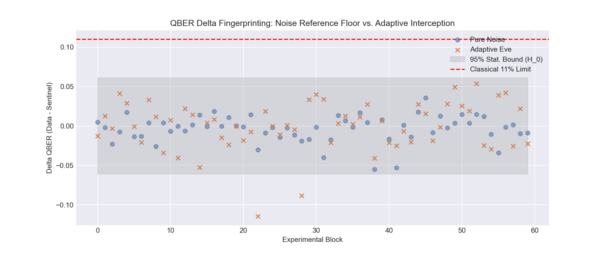
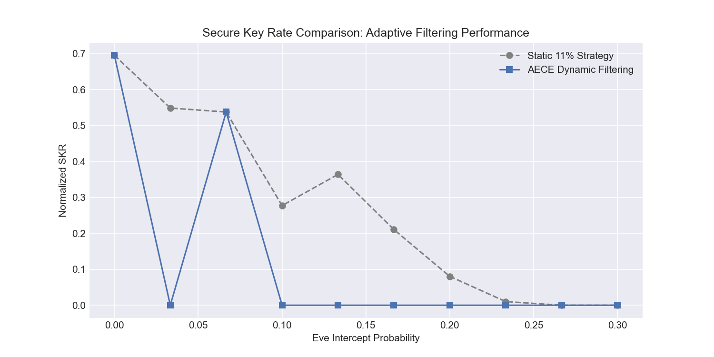
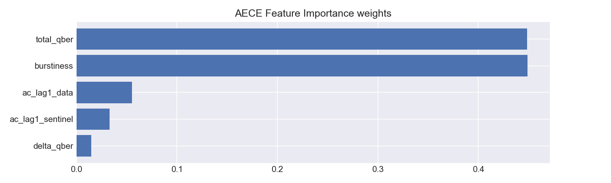

# Adaptive Eavesdropping Detection in BB84 QKD Protocols via Sentinel-Correlation Fingerprinting

> [!IMPORTANT]
> This repository presents a novel machine-learning approach to sub-threshold eavesdropping detection in Quantum Key Distribution (QKD) using interspersed sentinel qubits.

## 📄 Research Manuscript
The latest version of the research manuscript, including formal statistical proofs using Hoeffding bounds and information-theoretic security analysis, is available as a PDF:
**[Download Full Research Paper (PDF)](bb84_fingerprint_paper.pdf)**

---

## 🔬 Computational Results Overview
Our simulation framework evaluates the **Adversarial Error-Classification Engine (AECE)** across high-volume, 1,000-qubit distribution streams.

### 1. Error Delta Fingerprinting
By isolating the error rates of the non-cryptographic sentinel stream, the AECE identifies malicious interference that remains below the classical 11% QBER threshold.

*Figure 1: Distribution of QBER Delta. The gray area represents the 95% confidence interval ($\mathcal{H}_0$) for stochastic noise, illustrating how adaptive eavesdroppers (X) diverge from the noise floor.*

### 2. Secure Key Rate (SKR) Improvement
The AECE's dynamic filtering preserves noisy blocks that would otherwise be discarded under static rules, significantly increasing the effective key throughput.

*Figure 2: Performance comparison between traditional 11% static abort strategies and the AECE dynamic filtering suite across varying intercept probabilities.*

### 3. Feature Importance Synthesis
The Random Forest classifier leverages multi-dimensional temporal correlations to distinguish biological decoherence from deterministic state measurements.

*Figure 3: Internal weighting of the AECE classification model, highlighting the prominence of Delta QBER and Burstiness ($\beta$) in detecting sophisticated adversaries.*

---

## 🧪 Simulation Environment
The [BB84_QKD_Simulation.ipynb](BB84_QKD_Simulation.ipynb) serves as the primary research artifact for reproducibility. It employs a high-performance **vectorized numerical state-vector engine** suitable for large-scale Monte Carlo analysis.

**Core Prerequisites:**
* `numpy`, `scikit-learn`, `matplotlib`, `qiskit`

## Reproducibility
To execute the benchmark suite and regenerate the analysis:
1. Ensure the `qiskit-env` environment is active.
2. Launch the Jupyter Notebook to explore the interactive results.

---
**Institutional Affiliation:** IIIT - Andhra Pradesh  
**Primary Researcher:** Sree Charan Desu (<sreecharan309@gmail.com>)